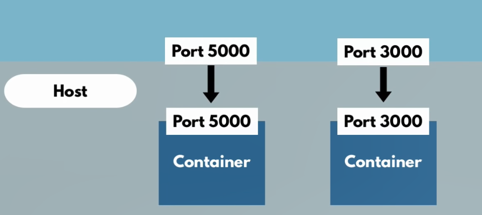

# Docker
## What is Docker ?
>- Docker is an open-source platform that automates the deployment , scailing and management of applications, inside lightweight and portable containers.
>- Containers allow developers to package applications with all the necessary dependencies and libraries, ensuring that they run consistently across different environments.

## Composenents of Docker
1. Docker Engine: The core of Docker, it includes:
>- Docker Daemon (dockerd): A background service responsible for managing containers, images, networks, and volumes.
>- Docker CLI (docker): A command-line interface for interacting with the Docker Daemon.
>- REST API: An interface that applications can use to communicate with the Docker Daemon.

2. Docker Images:
>- Read-only templates that define the contents of a container. They include everything needed to run an application, such as code, runtime, libraries, environment variables, and configuration files.
3. Docker Containers:
>- Lightweight, executable units of software that encapsulate an application and its dependencies. Containers are created from Docker images and run on the Docker Engine.


4. Docker Hub: 
>- A cloud-based registry service for storing and sharing Docker images. Users can upload their own images or download images created by others.
5. Docker Compose: 
>- A tool for defining and running multi-container Docker applications using a docker-compose.yml file.
6. Docker Swarm: 
>- A native clustering and orchestration tool for Docker that allows you to manage a group of Docker engines and scale your applications across multiple containers.

## How to install Docker on Ubuntu
- Instruction here : [Link](https://www.digitalocean.com/community/tutorials/how-to-install-and-use-docker-on-ubuntu-22-04#step-1-installing-docker)

### Structure of a dockerfile:
```
FROM python:3.10.12-slim
# This specifies the base image for the Docker container. In this case, it's a slim version of the Python 3.10.12 image, which is a smaller, more lightweight version of the full Python image.

WORKDIR /Blog
# This sets the working directory for the container to /Blog. Any subsequent commands (like COPY, RUN, etc.) will be executed from this directory.

# Copy the requirements file into the container
COPY requirements.txt /Blog/

# Install the dependencies
RUN pip install --no-cache-dir -r requirements.txt

# Copy the application code into the container
COPY . /Blog/

# Expose the port that the FastAPI application runs on
EXPOSE 8000

# Command to run the FastAPI application using uvicorn
CMD ["uvicorn", "main:app", "--host", "0.0.0.0", "--port", "8000"]

```
>Key Components of a Docker Image:
>1. Base Image:
> - Every Docker image starts from a base image. This can be a minimal Linux distribution like Alpine or a more complex setup like an Ubuntu image.
>2. Layers:
> - Docker images are composed of layers. 
> - Each layer represents an instruction in the image's Dockerfile.
> - For example, each RUN, COPY, or ADD instruction adds a new layer.
> - Layers are stacked on top of each other, and each layer is a delta of the changes from the previous layer. This makes images efficient and reusable.
>3. Dockerfile:
> - A Dockerfile is a text file that contains a list of instructions on how to build a Docker image. It specifies the base image, dependencies, configurations, and commands to run.
> - Multi-stage Docker file:\
> I. Reduced Image Size: By separating the build environment from the runtime environment, you can avoid including unnecessary build tools and dependencies in the final image, which reduces the image size.\
> II.Improved Security: The final image contains only the essential runtime dependencies, reducing the attack surface.\
> III. Easier Maintenance: Multi-stage builds allow for a more organized and cleaner Dockerfile, making it easier to maintain and update.

### Container Port and Host Port
 - Multiple Containers can run on your host machine.
 - Your machine has certain ports available those are open for some applications.
>Key Characteristics of Docker Containers:
>1. Isolation:
> - Containers provide process and file system isolation. Each container runs in its own environment, separated from other containers and the host system.
>2. Portability:
> - Containers can run consistently across different environments, such as development, testing, and production, as long as the host system supports Docker.
>3. Lightweight:
> - Containers share the host OS kernel, making them more lightweight and faster to start compared to virtual machines, which require a full OS for each instance.

Containers are designed to be stateless and ephemeral. When a container is stopped, its state can be discarded. Persistent data should be stored outside the container, typically using volumes.
### Docker Compose
 - Taking care of creating a common Network.

### Bind Mounts and Volumes
Bind Mounts and Volumes are two methods of storing data in Docker, but they have important differences in terms of how they work, flexibility, and suitable use cases.

1. Bind Mounts
> How it works:
> - You specify a specific path on the host to map to a path in the container.
When using bind mounts, Docker directly accesses data from the host's filesystem.
Bind Mounts are typically created and attached to containers in the following situations:

> Running a container with bind mounts:
 >- Bind mounts do **
 >- 
 >- NOT** need to be created beforehand as they simply map a directory or file on the host's filesystem to the container. 
 >- When you run the docker run command with the -v option and specify the host's path, the bind mount will be established.
> - When? Typically during the development phase, when you need to continuously modify source code or data without rebuilding the container. This allows you to easily test changes without having to stop and restart the container./

Setting up a development environment:

Bind Mounts:
1. During development, you can use bind mounts to map the source code from your system into the container. 
2. This allows you to easily edit the source code and see the changes immediately in the container without needing to rebuild or restart the container."

### How to set up Binds Mount
```bash
docker run -d \
  --name my_container \
  -v /path/on/host:/path/in/container \
  my_image
```
- /path/on/host: The directory or file path on your host machine.
- /path/in/container: The directory or file path inside the container where you want to mount the host directory.
- my_image: The Docker image you want to run.
- my_container: The name you want to give the container.

When using PostgreSQL in Docker, you can bind mount a directory from your host system to a directory inside the container to persist your database data. This ensures that your database files are stored on the host, making the data persistent even if the container is removed or recreated.


